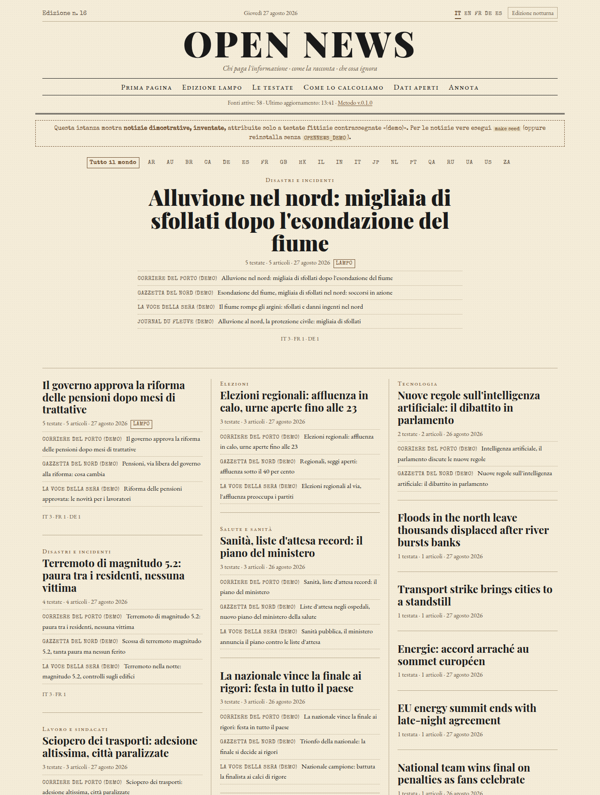
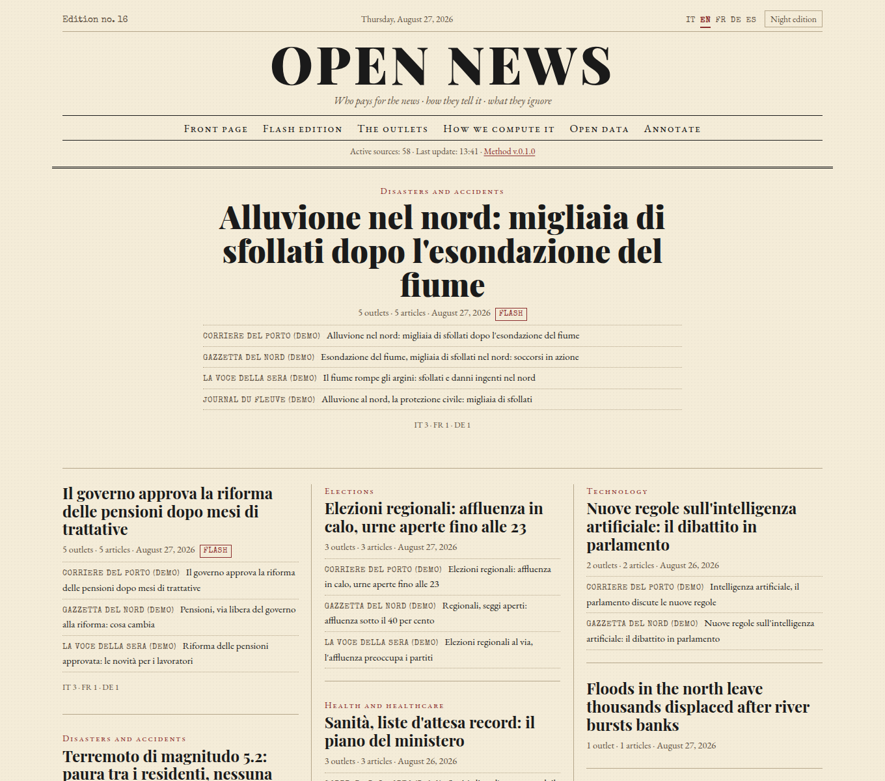
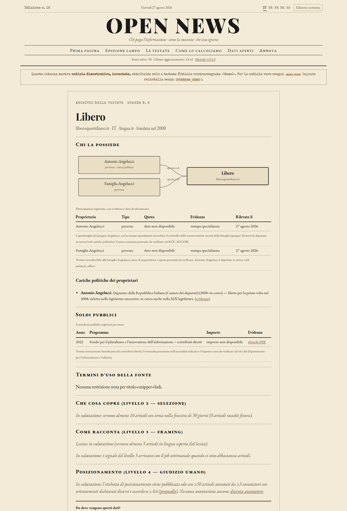
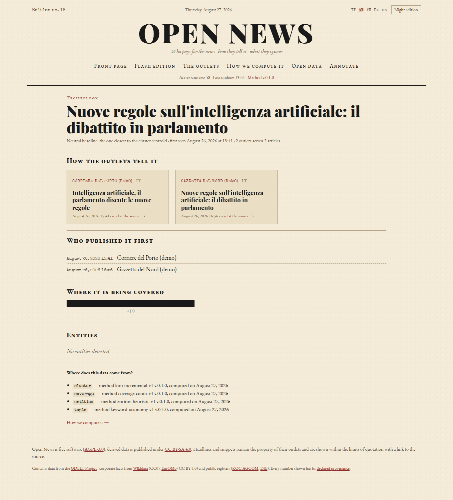
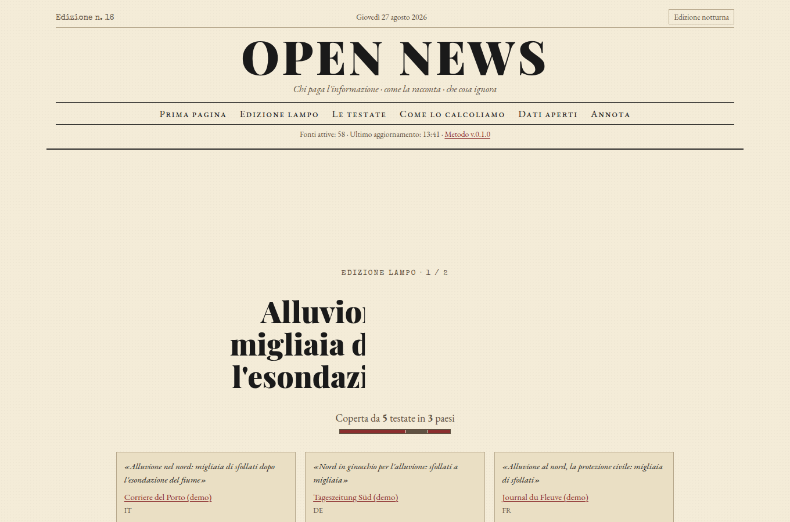

# Open News

**Who pays for the news · how they tell it · what they ignore.**

*Leggilo in italiano: [README.it.md](README.it.md)*

Open News is an open-source news aggregator that does not claim to
"remove bias" from the news: it **measures it, documents it and shows it**,
always citing the provenance of every figure. For every piece of news you
see who covered it and with which headlines; for every outlet you see who
owns it, how much public money it receives, which topics it covers more
than average and which stories it ignores.

The interface is a **newspaper in your browser**, styled like an
early-20th-century broadsheet, and speaks **five languages** (Italian,
English, French, German, Spanish — switchable from the masthead):

| | |
|---|---|
|  |  |
| *The front page: competing headlines side by side for every story* | *The same newspaper with the interface in English* |
|  |  |
| *An outlet's record card: owners, political offices, public money* | *A story: every outlet's version, who published first* |
|  |  |
| *The "flash edition": a paper reel of the hottest stories* | *On a phone, in the night edition* |

- Open-source software and free resources only: **no paid APIs**, no
  commercial service keys (a test enforces it)
- Every figure shown carries its **source, computation date and method**
- Software licence: **AGPL-3.0** · derived data: **CC BY-SA 4.0**

---

## One-line install — no Docker needed

**Linux / macOS:**

```bash
curl -fsSL https://raw.githubusercontent.com/zano97/open_news/main/install.sh | bash
```

**Windows** (PowerShell):

```powershell
powershell -ExecutionPolicy Bypass -c "irm https://raw.githubusercontent.com/zano97/open_news/main/install.ps1 | iex"
```

The script does everything by itself: downloads the app, fetches its own
Python (via [uv](https://github.com/astral-sh/uv) — nothing to preinstall),
creates the **“Open News” icon** (applications menu on Linux,
`~/Applications` on macOS, Start menu on Windows) and the `opennews`
terminal command, downloads the last 24 hours of news from the real outlets
(~10–15 minutes, first time only) and opens the newspaper in your browser.

From then on: **click the icon, or type `opennews`.** While it is open, the
news refreshes by itself every 10 minutes. Your data lives in `~/.opennews`.

Just want to **see the interface right away, without fetching real news**?
Demo mode (30 seconds; demo outlets clearly declared as such):

```bash
OPENNEWS_DEMO=1 curl -fsSL https://raw.githubusercontent.com/zano97/open_news/main/install.sh | bash
```

In this no-Docker mode the summaries work with the Ollama on your computer
out of the box (`http://localhost:11434`, the default).

**Updating** is one line too — it detects your install type by itself and
preserves all data:

```bash
curl -fsSL https://raw.githubusercontent.com/zano97/open_news/main/update.sh | bash
```

<details>
<summary><strong>Server mode with Docker</strong> (for a public instance: PostgreSQL+pgvector, Meilisearch, Caddy with automatic HTTPS)</summary>

```bash
OPENNEWS_DOCKER=1 curl -fsSL https://raw.githubusercontent.com/zano97/open_news/main/install.sh | bash
```

See [docs/DEPLOY.md](docs/DEPLOY.md) for domains/HTTPS, Oracle Free ARM,
Raspberry Pi, backups. In Docker mode the default Ollama URL is
`http://host.docker.internal:11434` (Ollama on the host machine).

</details>

**AI summaries, on request ("The story in brief").** On a story page the
reader can press a button and watch a neutral summary stream in — generated
by a **local open model via [Ollama](https://ollama.com)**, never a paid
service. The default configuration expects **Ollama installed on your
computer**:

```bash
OLLAMA_HOST=0.0.0.0 ollama serve      # so the Docker containers can reach it
ollama pull qwen2.5:7b                # a real Ollama tag (qwen2.5:3b on small machines)
```

then in the admin panel (`/impostazioni`) turn the switch on. The Ollama URL
field defaults to `http://host.docker.internal:11434`, which is **the special
address containers use to reach your computer** — `localhost` would point at
the container itself. If you prefer Ollama inside Docker instead, run
`docker compose --profile llm up -d` and set the URL to `http://ollama:11434`.
The panel's "Generator status" checks the connection live and tells you
exactly what is missing.

**News in your language.** Outlet headlines always stay in their original
language — their wording is the very thing the project measures. With the
optional open-source translator ([Argos Translate](https://www.argosopentech.com/),
local, free) the *neutral* story titles are translated into the interface
language, always marked as automatic:

```bash
docker compose exec worker pip install argostranslate
docker compose exec worker python -m scripts.fetch_translation_models
```

<details>
<summary><strong>Manual installation</strong> (if you prefer to see every step)</summary>

```bash
git clone https://github.com/zano97/open_news.git
cd open_news
cp .env.example .env            # 1. configure (see below)
docker compose up --build -d    # 2. start the full stack
docker compose exec api python -m scripts.verify_feeds   # 3. verify the real feeds
docker compose exec api python -m scripts.seed           # 4. populate (~10-15 minutes)
```

In `.env` set at least:

| Variable | Purpose |
|---|---|
| `POSTGRES_PASSWORD` | database password (generate one: `openssl rand -hex 32`) |
| `MEILI_MASTER_KEY` | Meilisearch key |
| `SECRET_KEY` | signs the annotators' session cookies |
| `DOMAIN` | (production only) your domain: Caddy fetches HTTPS certificates by itself |
| `EMBEDDING_BACKEND` | `hashing` (default, zero downloads) or `e5` (multilingual, recommended in production — see [docs/DEPLOY.md](docs/DEPLOY.md)) |

</details>

## How to use the application

There is nothing to learn: **the interface is the website itself** — you
use it from the browser like a normal online newspaper (phones included).
The terminal is only for installing and administering. The interface
language (IT · EN · FR · DE · ES) is switched from the masthead; news
content stays in the language each outlet wrote it in. The pages:

| Page | What you find there |
|---|---|
| **/** — Front page | The newspaper: today's stories in broadsheet style. Each story shows the neutral headline, **the different outlets' headlines side by side** (framing at a glance), coverage by country, and the "flash" and "blind spot" badges. |
| **/lampo** — Flash edition | The "paper reel": stories covered by ≥5 outlets in <2 hours, one full-screen card per story. Scroll, or use the ↑ ↓ keys. Three contrasting headlines chosen from the most diverse outlets, with the owner in small print. Works without JavaScript too. |
| **/storia/{id}** | One story, all versions side by side (headline + snippet + link to the source), the timeline of who published first, coverage by country, entities linked to Wikidata. With the optional local model enabled, a neutral "story in brief" summary — generated locally, always marked as automatic (full articles stay on the outlets' sites: republishing them would violate their copyright). |
| **/fonti** | The outlet catalog, including disabled sources with their reason (e.g. ANSA, due to its terms of use). |
| **/fonte/{slug}** | An outlet's "record card": ownership graph, political offices, public money per year, self-declared line, and the signals of the 4 levels (what it covers, how it tells it, positioning). Where data is insufficient you read "under evaluation" — never a hidden estimate. |
| **/mappa** | The co-coverage map: outlets sit close together when they cover the same stories. The axes **emerge from the data** and must be read through the stories listed under the map. |
| **/metodo** | The full methodology in plain language: how everything is computed, with the calibration figures and the known limits. |
| **/dati** | The open exports (CSV, CC BY-SA 4.0): stories, coverage, signals, anonymous annotations. JSON API documented at **/docs**. |
| **/impostazioni** | Admin panel (the first registered profile is the administrator): Ollama model and URL, embedding engine, clustering thresholds, collection courtesy interval. Changes are stored in the database, override `.env` and apply live. Methodology parameters are deliberately excluded. |
| **/annota** | Become an annotator: you judge headlines **without knowing which outlet they come from** (blind annotation) on two axes. Positioning labels are published only with ≥50 articles, ≥3 annotators with different declared orientations and agreement α ≥ 0.6. |

Top right you find the **night edition** (dark theme); the whole site is
keyboard-navigable and respects `prefers-reduced-motion`.

### Bias on four levels (never a single score)

1. **Structure (facts):** ownership, corporate chains, owners' political
   offices, public subsidies — from public registers (ROC AGCOM, EurOMo,
   Wikidata, DIE), always with evidence and date.
2. **Selection (statistics):** agenda profile against the average (with
   confidence intervals), co-coverage map, blind spots.
3. **Framing (lexical):** a curated lexicon of connoted terms, who gets
   quoted, headline tone distribution.
4. **Positioning (human judgement with a protocol):** blind annotation
   with measured inter-annotator agreement and explicit publication rules.

The four levels are shown **separately** and are never summed.

## Useful commands

```bash
make help          # full command list
make seed          # populate with real sources (~24h of news; needs network)
make seed-demo     # no network: declared demo outlets with invented news
make verify-feeds  # real HTTP verification of every feed in the catalog
make calibrate     # precision/recall of the clustering threshold on the annotated set
make test          # unit/integration tests with coverage (core >= 80%)
make test-e2e      # Playwright browser tests (desktop + mobile)
make check         # ruff + mypy --strict + tests
```

## Local development without Docker

```bash
make install       # creates .venv and installs dependencies (Python 3.12+)
make test          # 140 tests on SQLite, no external service needed
.venv/bin/python -m scripts.seed --offline-demo   # populate a local DB
DATABASE_URL=sqlite+aiosqlite:///dev.sqlite3 \
  .venv/bin/uvicorn apps.api.main:app --reload    # serve on :8000
```

(SQLite is fine for development; the compose stack uses PostgreSQL 16 +
pgvector in production.)

## Architecture

```
apps/
  api/      FastAPI: HTML pages (Jinja2+HTMX) and JSON API, OpenAPI at /docs
  web/      templates, hand-written CSS, self-hosted fonts, minimal JS,
            translation catalogs (it/en/fr/de/es)
  worker/   APScheduler: RSS/GDELT ingestion, clustering, entities, signals
core/
  models/   SQLAlchemy 2 async (portable PostgreSQL/SQLite)
  ingest/   RSS with conditional caching, robots.txt, rate limiting, GDELT
  extract/  canonical URLs, SimHash, language, full text (never exposed)
  nlp/      embeddings, topics, lexicon, quoted actors, tone, entities
  cluster/  incremental clustering with a calibrated threshold
  bias/     the 4 levels of the methodology + Krippendorff's alpha
  i18n.py   interface languages with per-key fallback
  net.py    the ONLY network exit point, with an allowlist (no paid services)
data/       source catalog, lexicons, topic taxonomy, evidence-backed seeds
docs/       METHODOLOGY (it/en) · DECISIONS (ADR) · LEGAL · DEPLOY
```

## Documentation

- [`docs/METHODOLOGY.en.md`](docs/METHODOLOGY.en.md) — the full methodology
  in plain language (Italian original: [`docs/METHODOLOGY.md`](docs/METHODOLOGY.md));
  it is the public `/metodo` page
- [`docs/DEPLOY.md`](docs/DEPLOY.md) — deployment on a VPS, **Oracle Cloud
  Always Free (ARM)**, **Raspberry Pi 5**, backups and monitoring
- [`docs/LEGAL.md`](docs/LEGAL.md) — what we show of others' content,
  robots/rate limits, per-source terms, personal data
- [`docs/DECISIONS.md`](docs/DECISIONS.md) — the architecture decision records

## Contributing

The data files grow via pull request, every entry with a rationale and a
source:

- `data/sources.yaml` — new outlets (with `terms_note` and verified feeds)
- `data/lexicon_it.yaml` / `lexicon_en.yaml` — the framing lexicon
- `data/topics.yaml` — the keywords of the topic taxonomy
- `data/seeds/ownership_it.yaml` — ownership data **with evidence**;
  the rule: never an invented figure, `null` with a note beats a guess
- `apps/web/translations/*.yaml` — interface translations (same keys as
  `it.yaml`; a test enforces parity)

Quality bar: `make check` must pass (ruff, mypy `--strict`, coverage ≥ 80%).

## Licences

Code **AGPL-3.0-only** ([LICENSE](LICENSE)) · derived data **CC BY-SA 4.0**
(exportable from `/dati`) · third-party attributions in [NOTICE](NOTICE).
Headlines and snippets remain the property of their outlets and are shown
within the limits of quotation with a link to the source.
